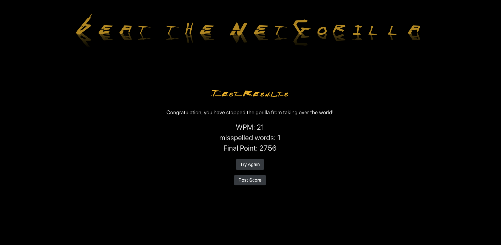

<h1> Beat The NetGorilla </h1>


<h2>Summary </h2>

- [About the Project](#about-the-project)
- [Usage](#usage)
- [Screenshots](#videos-and-screenshots)
- [Getting Started](#getting-started)
- [Built With](#built-with)
- [Authors](#authors)

## About the Project

Beat The NetGorilla is a speed typing game built with React for frontend and Node.js for backend. The test quote is generated randomly to create unique experience for each gameplay. Your speed and accuracy is calculated simultaneously so you can check your progress.

## Usage

To start, visit [Beat The NetGorilla](http://net-gorilla.surge.sh/).

Once you're in, you will be able to choose your level (higher level will have more blank characters) and your gameplay type (either words or quote ). You have to type as fast as you can in 60 seconds. The game will end if your wpm (words per minutes) falls below 35 wpm.

## Videos and Screenshots

Click below to see Boris demo Gachasphere:





To set up a local copy of the project follow the steps below. Be sure to follow the instructions in the [server-side repository](https://github.com/hptran7/Beat-The-NetGorilla.git) as well.

# Prerequisites

- In an empty folder initialize a new Node.js project.

```sh
npm init
```

# Installation

1. Clone to local machine

```sh
git clone https://github.com/hptran7/Beat-The-NetGorilla.git
```

2. Install NPM packages

```sh
npm install
```

3. Start program

```sh
npm start
```

## Built With

- Javascript
- CSS
- [React](https://reactjs.org/)
- [Redux](https://redux.js.org/)
- [React Redux](https://react-redux.js.org/)
- [React Router DOM](https://reactrouter.com/web/guides/quick-start)
- [Axios](https://github.com/axios/axios)
- [History](https://www.npmjs.com/package/history)
- [Node.js](https://nodejs.org/en/)
- [Express](https://expressjs.com/)
- [Sequelize](https://sequelize.org/)
- [PostgreSQL](https://www.postgresql.org/)

## Authors

- **Hung Tran** - [hptran7](https://github.com/hptran7)

## Acknowledgements
